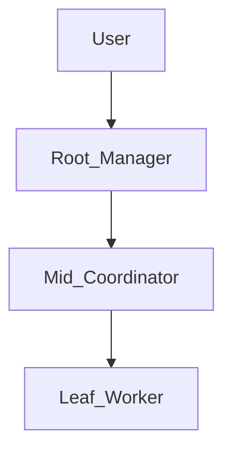
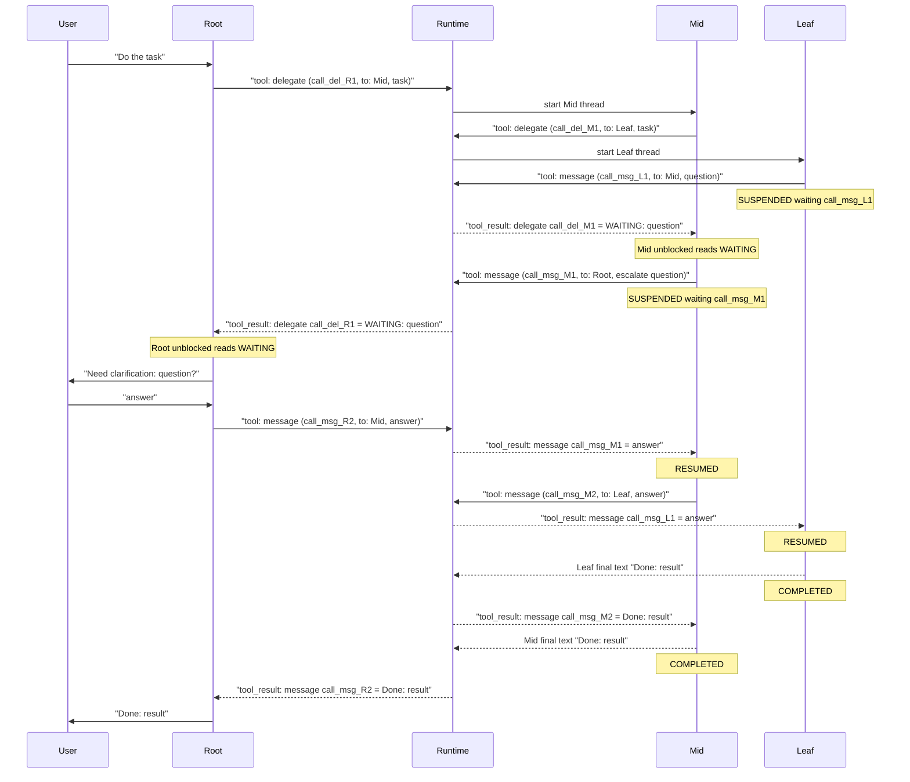
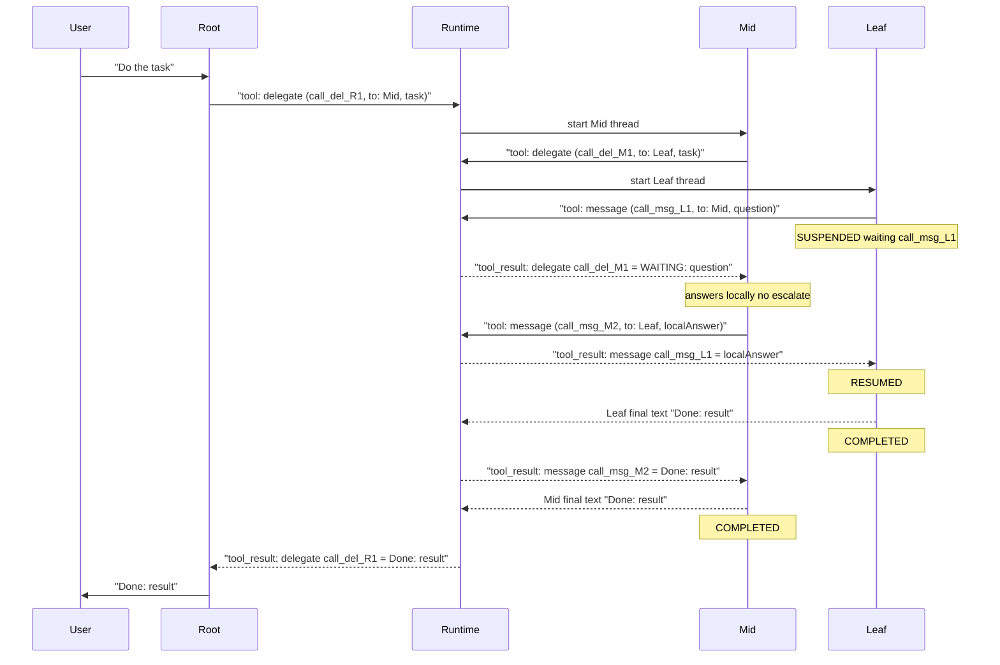

# Plan: Multi-agent Framework (Multi-level Hierarchy)

## Goal

Build a TypeScript **class-based** framework for defining agents and wiring them into a **multi-level tree** (optional parent, many children). Own **agent loop** (no LangGraph). LLM via `@sap-ai-sdk/orchestration` (credentials from `AICORE_*` env). Demo: minimal hierarchy showing `delegate → message → resume`, including cases where a parent **answers a child message itself** or **escalates** to its own parent (and only the root may involve the user).

## Function calling (mandatory)

All agent tools — communication (`delegate`, `message`) and any domain tools — are exposed as **LLM function calling** tools (SAP Orchestration `ChatCompletionTool` / `prompt.tools`).

- The model decides tool use via native `tool_calls` in the assistant message (not free-text “call tool X” protocols).
- Runtime executes each call by `tool_call_id` + function name/arguments, then appends a `role: "tool"` message with `tool_call_id` and string content.
- Next LLM turn uses `messages` + `messagesHistory` so the model sees prior assistant `tool_calls` and matching tool results.
- Suspend/resume for upward `message` is still function calling: the child’s pending `message` has no tool result until a parent `message` supplies it; then Runtime posts that delayed `role: "tool"` result and continues the child loop.
- Multiple `tool_calls` in one assistant turn are supported in order (execute sequentially in the agent loop).

Reference: [SAP AI SDK — Function Calling](https://sap.github.io/ai-sdk/docs/js/orchestration/chat-completion).

## Architecture

### Hierarchy



Any non-root agent may request clarification from its parent via **`message`**. The immediate parent receives a `WAITING` result from `delegate` / `message` and must either:

1. **Answer locally** via `message` to the child (no user involvement), or
2. **Escalate** to its own parent via `message` (nested suspend), or
3. If it is the **root**, surface the question to the **console user**, then `message` the answer downward.

**Communication tools:** only `delegate` and `message` (no separate `ask` tool). Direction of `message` is by `agentId`:

- **To parent** → suspend self, bubble `WAITING` to the parent's open `delegate`/`message`
- **To child** → resume that child's pending upward `message`, continue child loop

### Happy path (Leaf messages parent, Mid escalates, Root asks user)

Tool calls and `tool_result`s are explicit. Nested `delegate`/`message` stay open until the child finishes or returns `WAITING`.



Step-by-step pairing:

1. Root `delegate(call_del_R1)` → later `tool_result` is either `WAITING: …` or final Mid text.
2. Mid `delegate(call_del_M1)` → later `tool_result` is either `WAITING: …` or final Leaf text.
3. Leaf `message(call_msg_L1, to Mid)` → suspends Leaf; Mid gets `tool_result` of `call_del_M1` = `WAITING`.
4. Mid `message(call_msg_M1, to Root)` → suspends Mid; Root gets `tool_result` of `call_del_R1` = `WAITING`.
5. Root `message(call_msg_R2, to Mid)` → delivers `tool_result` for Mid’s pending `call_msg_M1`; when Mid finishes (after messaging Leaf), Root gets `tool_result` of `call_msg_R2` = final text.
6. Mid `message(call_msg_M2, to Leaf)` → delivers `tool_result` for Leaf’s pending `call_msg_L1`; when Leaf finishes, Mid gets `tool_result` of `call_msg_M2` = Leaf final text.

### Parent answers without user

Mid answers Leaf locally: no Mid escalate `message` to Root, no user turn. Root’s open `delegate` stays blocked until Mid completes.



Pairing here:

1. Root `delegate(call_del_R1)` → single `tool_result` = final Mid text (no WAITING at root).
2. Mid `delegate(call_del_M1)` → `tool_result` = `WAITING: question`.
3. Mid `message(call_msg_M2, to Leaf)` → completes Leaf’s pending `call_msg_L1`; `tool_result` of `call_msg_M2` = Leaf final text.
4. That completion unblocks Mid’s loop → Mid returns → becomes `tool_result` of Root’s `call_del_R1`.

### Layers

- **Framework** ([src/framework/](src/framework/)): classes, loop, communication tools, thread state
- **LLM** ([src/llm/](src/llm/)): thin wrapper over `OrchestrationClient`
- **Demo** ([src/demo/](src/demo/)): 3-level tree + simple domain prompts
- **CLI** ([src/cli/](src/cli/)): readline → root agent

## Class model

### `Tool`

```ts
class Tool {
  constructor(
    public readonly name: string,
    public readonly description: string,
    public readonly parameters: object, // JSON Schema
    public readonly execute: (
      args: unknown,
      ctx: ToolContext,
    ) => Promise<string> | string,
  ) {}
  toChatCompletionTool(): ChatCompletionTool; // SAP SDK format
}
```

### `Agent`

- Fields: `id`, `systemPrompt`, `tools: Tool[]`, `parent?: Agent`, `children: Map<string, Agent>`
- Methods: `addChild(agent)` (sets parent link both ways), `getChild(id)`, `isRoot`, `hasChildren`
- Effective tool list = domain tools + communication tools injected by Runtime:
  - Has children → `delegate`, `message`
  - Has parent → `message` (to parent: question / escalate; suspend + WAITING)
  - Leaf (parent, no children) → `message` only
  - Root with children → `delegate`, `message` only (user is reached by returning plain text / WAITING handling in the CLI loop)

### `AgentThread`

- `threadId`, `agentId`, `parentThreadId?`, `messages[]`
- `status: running | waiting | completed`
- `pendingMessage?: { toolCallId, content, targetAgentId }` (upward `message` awaiting parent reply)
- Isolated message history per thread

### `Runtime`

Core orchestration (function-calling agent loop):

1. `run(rootAgent, userMessage)` — drive the root agent loop until it returns final text for the user.
2. Agent loop:
   - Call LLM with current messages + registered function tools.
   - If assistant has **no** `tool_calls` → treat `content` as turn result (return to caller / user).
   - If assistant has `tool_calls` → for each call, run the matching `Tool.execute`, append `{ role: "tool", tool_call_id, content }`, then call LLM again with updated history.
3. Communication tools (still function tools):
   - **`delegate({ agentId, task })`**: spawn child thread, run child loop. If child suspends on upward `message`, return `"WAITING: <question>"` as the **function result** of this `delegate` call (and keep child suspended). If child completes, return final child text as the function result.
   - **`message({ agentId, content })`**:
     - **To parent:** mark current thread `waiting`, store pending `tool_call_id`; **do not** emit the `role: "tool"` result until the parent later `message`s back. Completing the parent's open `delegate`/`message` with WAITING unblocks the parent loop.
     - **To child:** resume the waiting child by emitting the delayed `role: "tool"` result for the child's pending upward `message` `tool_call_id`; continue child loop; return either final child result or another nested WAITING as this `message` function result.
4. Bookkeeping: `Map<threadId, AgentThread>`, link parent function-call id ↔ child thread.

**Nested wait semantics:** a Mid agent can be `waiting` on its parent (pending upward `message`) while its Leaf child is also `waiting` on Mid. Resume is always **top-down** via `message` along the same chain.

**Root + user:** when the root’s `delegate`/`message` returns WAITING, the Runtime/CLI surfaces the question to the user, then the root (on the next user turn or within the same CLI helper) issues `message` downward. Prefer: root agent loop ends a turn with text asking the user; next user input continues the same root thread so the model can call `message`.

### `LlmClient`

```ts
class LlmClient {
  constructor(modelName = process.env.AICORE_MODEL ?? "gpt-4o") {}
  chat(
    messages: ChatMessage[],
    tools: ChatCompletionTool[],
  ): Promise<{
    content?: string;
    toolCalls?: MessageToolCalls;
    allMessages: ChatMessage[];
  }>;
}
```

Wraps `OrchestrationClient.chatCompletion` with `promptTemplating.prompt.tools` and follows the official function-calling pattern: read `response.getToolCalls()` / assistant message, execute functions, send `ToolChatMessage`s with `messagesHistory: response.getAllMessages()`. Real AI Core only (choice 2A — no mock).

### `ConsoleApp`

- readline loop against the **root** agent thread (persistent conversation with root)
- Print root replies; log delegate/message on stderr for demo clarity

## File layout

```
src/
  framework/
    tool.ts
    agent.ts
    thread.ts
    runtime.ts
    types.ts
  llm/
    llm-client.ts
  demo/
    agents.ts          // buildRootTree(): Root → Mid → Leaf
  cli/
    console-app.ts
  apps.ts              // wire tree, start CLI
```

## Demo (1B — minimal, multi-level)

Three agents:

- **Leaf**: does the concrete task; uses `message` to Mid when a parameter is missing
- **Mid**: delegates to Leaf; on WAITING either answers via `message` to Leaf, or escalates via `message` to Root
- **Root**: delegates to Mid; on WAITING either answers itself via `message` or asks the user (plain assistant message)

Example flows covered in prompts/README:

1. Leaf `message` → Mid answers locally via `message` → no user question
2. Leaf `message` → Mid escalates via `message` to Root → Root asks user → answers cascade down via `message`

## Project setup

- Add `@sap-ai-sdk/orchestration` to [package.json](package.json)
- Enable `"types": ["node"]` and `"lib": ["esnext"]` in [tsconfig.json](tsconfig.json)
- `.env.example`: AI Core service key / standard SAP AI SDK env vars + `AICORE_MODEL`
- `.gitignore`: `node_modules`, `dist`, `.env`
- Scripts: keep `build` (`tsc`) and `start` (`node dist/apps.js`)

## Implementation order

1. Types + `Tool` + `Agent` + `AgentThread` (tree links)
2. `LlmClient`
3. `Runtime` loop + `delegate` / `message` with nested suspend/resume and parent resolve-or-escalate
4. Demo 3-level tree + `ConsoleApp` + entrypoint
5. Short README: AI Core setup, run instructions, both clarification flows (local answer vs escalate to user)

## Out of scope

- Thread persistence, parallel multi-delegate, streaming UI, LangChain/LangGraph, mock LLM
