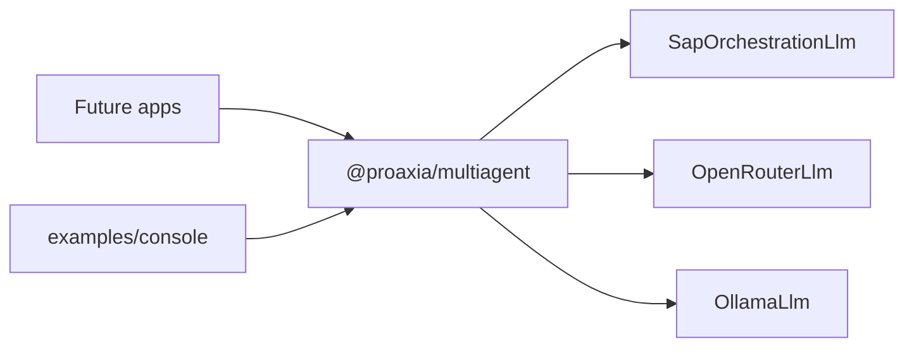

# Split the framework into a reusable library

One git repo, two npm packages. The library exposes agents and a swappable LLM proxy. Callers pass credentials, model names, and hosts into the proxy constructors. The football console demo stays here, loads those values from its own env file, and imports the library by package name.



The git remote is `https://github.com/posiadly/multiagent_framework.git`. [package.json](package.json) still records the old Gitea URL; update `repository.url` to that GitHub address on the root and on the library package.

Publishing (npm or GitHub Packages) is out of scope. The library package will be ready to publish (`exports`, `files`, its own version). `npm install git+https://github.com/posiadly/multiagent_framework.git` will not give other apps the library, because npm installs the private root, not the workspace package.

## LLM proxy

`Runtime` today takes the concrete SAP `LlmClient` and passes `@sap-ai-sdk/orchestration` `ChatCompletionTool` values ([src/framework/runtime.ts](src/framework/runtime.ts), [src/framework/tool.ts](src/framework/tool.ts)). Replace that with a provider-neutral interface in the library:

```ts
export interface LlmTool {
  type: "function";
  function: {
    name: string;
    description: string;
    parameters: Record<string, unknown>;
  };
}

export interface Llm {
  chat(messages: ChatMessage[], tools: LlmTool[]): Promise<LlmChatResult>;
}
```

`Tool.toChatCompletionTool()` becomes `toLlmTool()` and returns `LlmTool`. `Runtime` stores `Llm` and no longer imports the SAP SDK. `LlmChatResult` stays as it is in [src/llm/llm-client.ts](src/llm/llm-client.ts).

The library does not read `process.env`. Every secret, model name, and host comes from the application that constructs the proxy.

- **SAP Orchestration** — `createSapOrchestrationLlm({ model, serviceKey })`. `serviceKey` is the AI Core service-key JSON (string or object) the app already loaded. The factory reads `clientid`, `clientsecret`, `url`, and `serviceurls.AI_API_URL` from that object and passes an OAuth2 client-credentials destination as the third `OrchestrationClient` argument (`deploymentConfig` is `{ resourceGroup: "default" }`). It does not read `AICORE_SERVICE_KEY` or `AICORE_MODEL`. Move the current chat body, including `splitForRequest` / `messagesHistory`, into this factory. This file is the only one that imports `@sap-ai-sdk/orchestration`. Export it from `@proaxia/multiagent/sap` so apps that use OpenRouter or Ollama do not load it. Declare `@sap-ai-sdk/orchestration` as an optional `peerDependency` of the library, and as a direct dependency of the console example.
- **OpenRouter** — `createOpenRouterLlm({ apiKey, model })`. `fetch` to `https://openrouter.ai/api/v1/chat/completions` with `Authorization: Bearer <apiKey>`, OpenAI-style `messages` and `tools`. The app passes `apiKey` and `model`. No extra npm dependency.
- **Ollama** — `createOllamaLlm({ baseUrl, apiKey, model })`. Same OpenAI-compatible chat body, posted to `{baseUrl}/v1/chat/completions` with `Authorization: Bearer <apiKey>`. The app passes `baseUrl`, `apiKey`, and `model`. No extra npm dependency.

OpenRouter and Ollama share one internal OpenAI-compatible client. The SAP client stays separate because Orchestration splits the latest tool results into `messages` and the rest into `messagesHistory`.

Public surface:

- `@proaxia/multiagent` — `Agent`, `Runtime`, `Tool`, `Llm`, `LlmTool`, `createOpenRouterLlm`, `createOllamaLlm`
- `@proaxia/multiagent/sap` — `createSapOrchestrationLlm`

## Packages

**Library** at [packages/multiagent](packages/multiagent), name `@proaxia/multiagent`:

- Move [src/framework](src/framework) to `packages/multiagent/src/` (`agent.ts`, `thread.ts`, `tool.ts`, `runtime.ts`, `types.ts`, `index.ts`).
- Add `llm.ts` (interface), `openai-compatible-llm.ts`, `openrouter-llm.ts`, `ollama-llm.ts`, and `sap-orchestration-llm.ts`.
- `package.json` exports `"."` and `"./sap"`, `"files": ["dist"]`, `"type": "module"`. No required LLM dependency on the library itself.

**Example** at [examples/console](examples/console), private package `multiagent-console`:

- Move [src/demo/agents.ts](src/demo/agents.ts), [src/cli/console-app.ts](src/cli/console-app.ts), and [src/apps.ts](src/apps.ts).
- A small `createLlm()` in the example reads `LLM_PROVIDER` and the matching env vars, then passes those values into the library. The library calls do not see `process.env`.
  - `sap` (default) — `createSapOrchestrationLlm({ model, serviceKey })` from `AICORE_MODEL` and `AICORE_SERVICE_KEY`
  - `openrouter` — `createOpenRouterLlm({ apiKey, model })` from `OPENROUTER_API_KEY` and `OPENROUTER_MODEL`
  - `ollama` — `createOllamaLlm({ baseUrl, apiKey, model })` from `OLLAMA_BASE_URL`, `OLLAMA_API_KEY`, and `OLLAMA_MODEL`
- Dependencies: `@proaxia/multiagent` as `workspace:*`, `@sap-ai-sdk/orchestration`, `dotenv`.

## Tooling

Root [package.json](package.json) becomes private, with `"workspaces": ["packages/*", "examples/*"]`. Scripts:

- `build` — library first, then the example
- `start` / `dev` — run the example

Each package gets its own `tsconfig.json` copied from the current [tsconfig.json](tsconfig.json) (`nodenext`, `declaration`, `verbatimModuleSyntax`), with that package's `rootDir` / `outDir`. Delete the root `tsconfig.json` once both packages compile.

[.gitignore](.gitignore) currently ignores only `/dist` at the repo root. Change it to `dist` so `packages/multiagent/dist` and `examples/console/dist` are ignored.

Keep [.env.example](.env.example) and `.env` at the repo root. They belong to the console example, which is the app that loads them and passes the values into the library. Add `LLM_PROVIDER` and the OpenRouter / Ollama variables next to the existing `AICORE_*` keys. The example start script runs with the package as cwd, so load env with Node's `--env-file=../../.env` instead of `import 'dotenv/config'` (that would look for `.env` inside `examples/console`).

Update [.vscode/launch.json](.vscode/launch.json) and [.vscode/tasks.json](.vscode/tasks.json) so debug builds the example tsconfig and launches `examples/console/dist/apps.js`, still reading `${workspaceFolder}/.env`.

Set `repository.url` to `https://github.com/posiadly/multiagent_framework.git` in the root [package.json](package.json) and in the library package.

Update [README.md](README.md): workspace layout, the three proxies, and the public import:

```ts
import { Agent, Runtime, createOllamaLlm } from "@proaxia/multiagent";
import { createSapOrchestrationLlm } from "@proaxia/multiagent/sap";

const runtime = new Runtime(
  createSapOrchestrationLlm({
    model: "gpt-4o",
    serviceKey: serviceKeyJson,
  }),
);

const ollamaRuntime = new Runtime(
  createOllamaLlm({
    baseUrl: "http://localhost:11434",
    apiKey,
    model: "llama3.1",
  }),
);
```

## Check

`npm install` at the root, then `npm run build`. `npm start` with `LLM_PROVIDER=sap` should load `AICORE_SERVICE_KEY` and `AICORE_MODEL` in the example and pass them into `createSapOrchestrationLlm`. The football tree should still answer through `Runtime.chat`. OpenRouter and Ollama are compiled and wired the same way; a live call for those two needs values the example reads from env and passes in.
